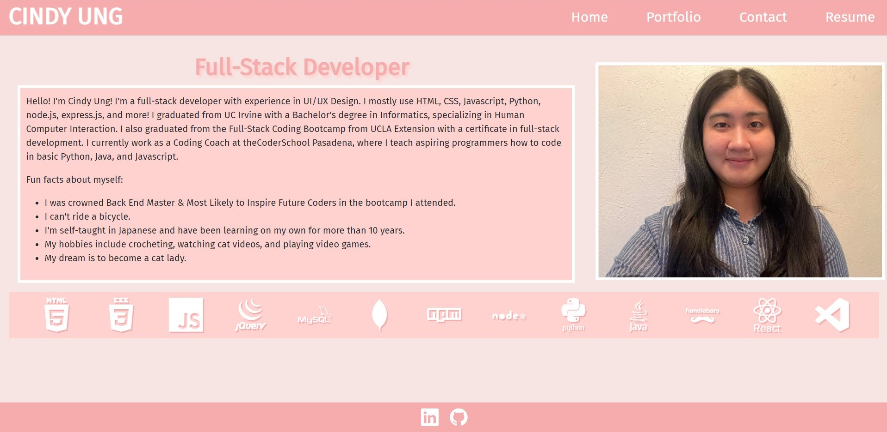
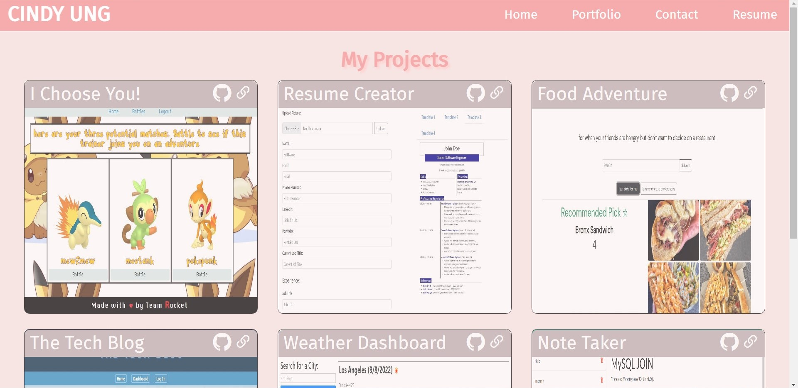
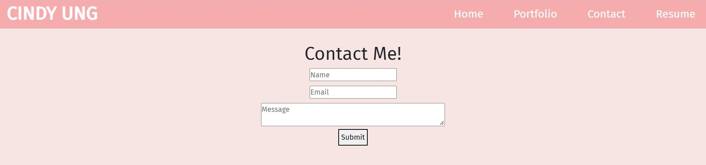
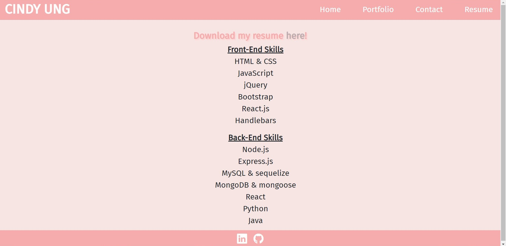

# My React Portfolio

## Description

Welcome to my portfolio! This portfolio was created using React.js and showcases my profile and six of the projects I have done. More will be added at a later date. Feel free to download my resume and contact me on LinkedIn or email!

This is the home page where you can see a short description about me and my skills.

Here is my portfolio with my projects! All cards show an image of the application for a quick glance at what they are. GitHub and deployed links are to the top right corner if you want to check them out for yourself!

This is a section to contact me by leaving a message. Functionality to send it to my email will be added at a later date. All three fields must be filled out in order for the form to be sent properly.

This is a section to see my skills in list format and also to download my resume. My resume also includes my information such as phone number, email, and LinkedIn page.

## Links

Github Repository: [https://github.com/cindyung56/react-portfolio](https://github.com/cindyung56/react-portfolio)

Link to Portfolio: [https://cindyung56.github.io/react-portfolio/](https://cindyung56.github.io/react-portfolio/)